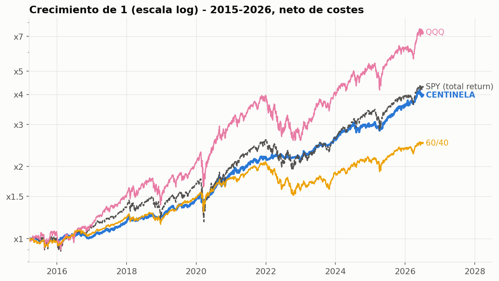
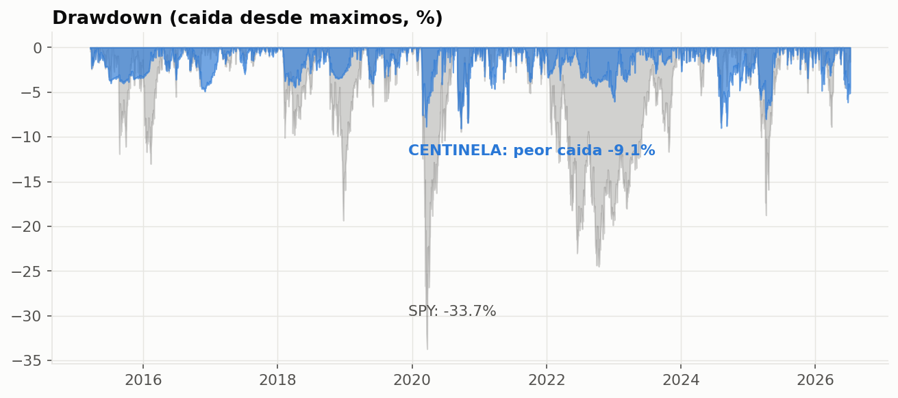
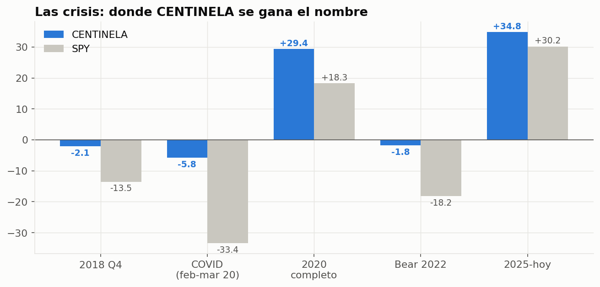
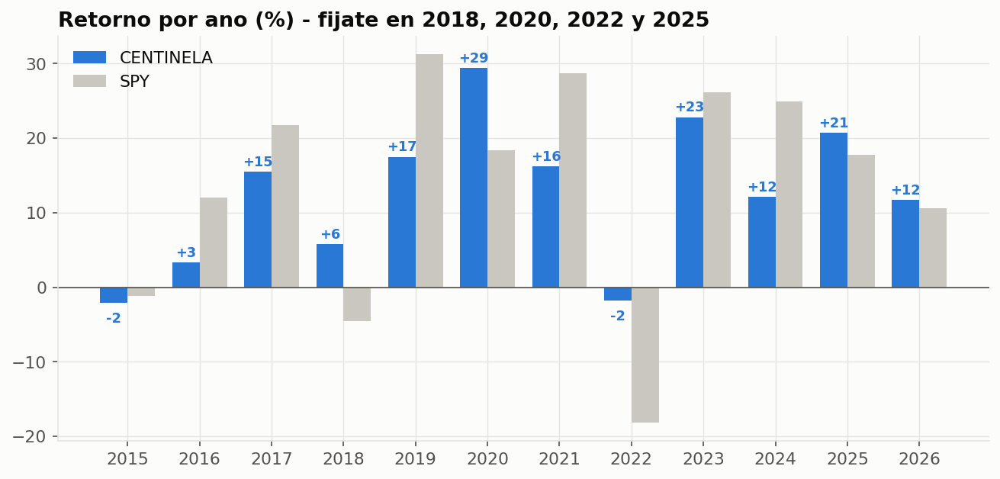
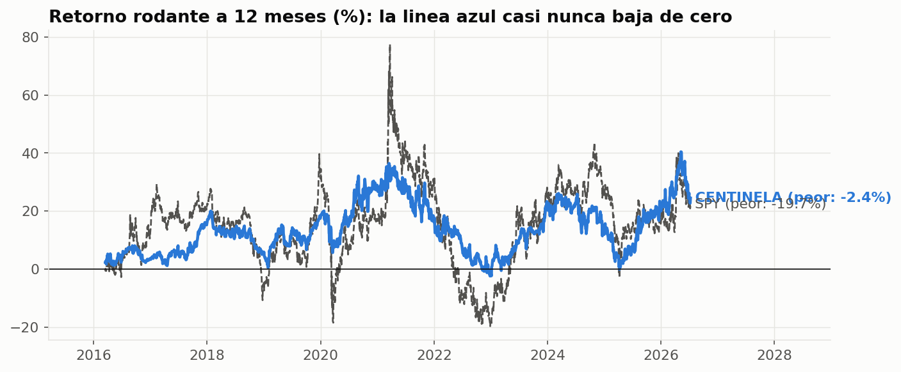
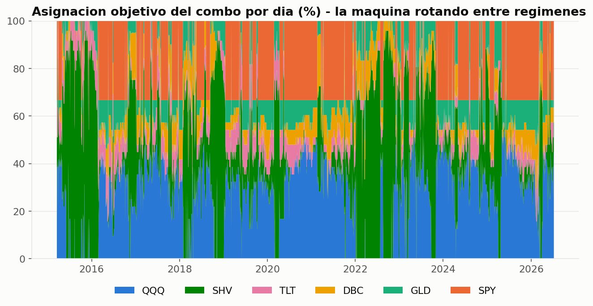
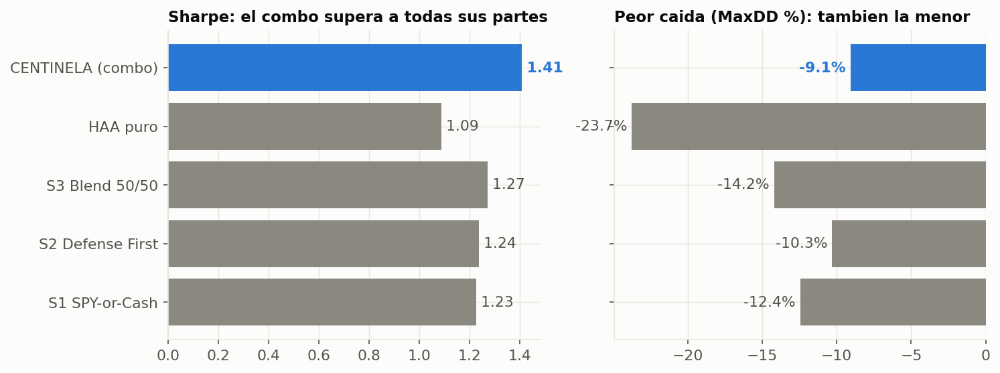
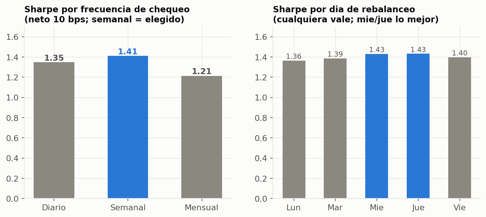

# CENTINELA — Asignación Táctica de Activos (TAA Combo)

> **Rentabilidad tipo-bolsa con un tercio del susto.** Una estrategia de asignación
> táctica (familia HAA de Keller) que rota entre 6 ETFs guiada por momentum y un
> "canario" de régimen, validada con una batería completa de robustez estadística.



**La historia en una imagen:** la línea azul (CENTINELA) llega prácticamente al mismo
sitio que el S&P 500 (SPY)… pero mira lo *lisa* que es. Ese es el producto: el mismo
destino sin los precipicios.

---

## 1. ¿Qué es CENTINELA?

CENTINELA es el promedio a partes iguales de **tres sub-estrategias momentum** sobre
un universo de 6 ETFs (QQQ, SPY, SHV, TLT, DBC, GLD), con el bono ligado a inflación
**TIP como canario**: cuando su tendencia se tuerce, la estrategia se repliega a
activos defensivos o liquidez **antes** de que llegue la tormenta.

| Sub-estrategia | Carácter |
|---|---|
| **SPY-or-Cash** | Binaria: 100% SPY si el régimen es favorable, 100% liquidez si no |
| **Defense First** | Siempre invertida, reparte entre ofensivo (QQQ) y defensivos según momentum |
| **Blend 50/50** | Punto medio entre la agresiva (HAA) y la defensiva |

Pertenece a la familia **HAA (Hybrid Asset Allocation)** de Wouter Keller & Jan
Keuning (2022) — una metodología publicada y estudiada, no una caja negra.

**Para quién es:** capital que **no puede permitirse un −35%**. Prioriza dormir
tranquilo sobre exprimir el último punto de rentabilidad.

---

## 2. Resultados (2015–2026, neto de costes)

Backtest con pesos exactos, chequeo semanal + banda de deriva 8%, 10 pb de coste
por rotación, precios total-return:

| | **CENTINELA** | SPY (B&H) | QQQ (B&H) | 60/40 | S&P 500 (índice precio) |
|---|---:|---:|---:|---:|---:|
| **CAGR** | 13.0% | 13.8% | 19.2% | 8.5% | 12.0% |
| **Sharpe** | **1.41** | 0.82 | 0.91 | 0.78 | 0.72 |
| **Sortino** | **1.72** | 1.00 | 1.17 | 0.99 | 0.88 |
| **Calmar** | **1.44** | 0.41 | 0.55 | 0.31 | 0.35 |
| **Peor caída (MaxDD)** | **−9.1%** | −33.7% | −35.1% | −27.5% | −33.9% |
| **Peor año** | **−2.1%** | −18.2% | −33% | — | — |
| **Peor ventana 12m** | **−2.4%** | −19.7% | — | — | — |
| **Peor ventana 36m** | **+17.3%** | +1.1% | — | — | — |
| **Máx. días bajo aguas** | **221** | 488 | 493 | 663 | 512 |



**Traducción:** en 11 años, CENTINELA nunca ha tenido un trienio en pérdidas, su
peor año fue −2.1%, y su peor caída fue −9% cuando la bolsa se hundía un −34%.

---

## 3. El matiz honesto (léelo antes de nada)

Este repo pretende convencer **con la verdad**, así que primero lo que CENTINELA
**no** hace:

- **NO supera al SPY (S&P 500 con dividendos) en retorno bruto**: 13.0% vs 13.8%
  CAGR. Cede ~0.8 puntos/año y pierde contra SPY la mayoría de los años alcistas
  (2016, 2017, 2019, 2021, 2023, 2024). Ese peaje es **la prima del seguro**.
- **SÍ supera** al índice S&P 500 de precio (12.0%), al 60/40 (8.5%) y a la cartera
  equiponderada de sus propios activos (9.8%).
- Donde arrasa es en **calidad del retorno**: diferencia de Sharpe vs SPY = **+0.59**,
  con intervalo bootstrap 95% [+0.09, +1.07] y **p = 0.009** → estadísticamente
  real, no suerte. Alpha anualizado **+8.5%/año** con beta 0.28.

**El framing correcto:** "rentabilidad ~equity con un tercio del drawdown y
recuperaciones el doble de rápidas", no "gana siempre a la bolsa".

### Y el matiz aún más importante: el ciclo completo (2008–2026)

Los números de arriba son de 2015–2026, un periodo amable. Extendida a **19 años con
la crisis de 2008 dentro**, la expectativa honesta es: **CAGR ~10% · Sharpe ~0.9 ·
caídas de hasta −17% · posibles 3-4 años mediocres seguidos** (2010–2013). A cambio:
en 2008 hizo **+9%** mientras el SPY caía −51% peak-to-trough, y su Sharpe de ciclo
completo (0.94) sigue aplastando al del SPY (0.66). Además, **sobrevivió a 685
configuraciones retadoras** en dos campañas de búsqueda masiva pre-registradas sin
que ninguna la batiera. Detalle completo, gráficos y campañas:
**[docs/CICLO_COMPLETO.md](docs/CICLO_COMPLETO.md)** ← *léelo antes de invertir*.


---

## 4. Las crisis: donde se gana el nombre



| Tramo | CENTINELA | SPY |
|---|---:|---:|
| 2018 Q4 | **−2.1%** | −13.5% |
| COVID crash (feb–mar 2020) | **−5.8%** | −33.4% |
| 2020 completo | **+29.4%** | +18.3% |
| Bear 2022 (inflación) | **−1.8%** | −18.2% |
| 2025–hoy | **+34.8%** | +30.2% |

Gana **todas** las crisis del periodo, con margen enorme. El canario TIP + el
momentum sacan la cartera a defensivos/liquidez antes de lo peor.

---

## 5. Año a año y ventanas rodantes




- 10 de 12 años positivos (los dos negativos: −2.1% y −1.8%).
- Solo el **1%** de las ventanas rodantes de 12 meses acabó en negativo (SPY: mucho más, y con −19.7% de fondo).
- La rotación de la cartera día a día:



---

## 6. El combo se justifica: mejor que todas sus partes



| Estrategia (misma regla de rebalanceo) | CAGR | Sharpe | MaxDD | Calmar |
|---|---:|---:|---:|---:|
| S1 SPY-or-Cash sola | 12.4% | 1.23 | −12.4% | 0.99 |
| S2 Defense First sola | 11.9% | 1.24 | −10.3% | 1.15 |
| S3 Blend 50/50 sola | 14.1% | 1.27 | −14.2% | 0.99 |
| HAA pura | 15.6% | 1.09 | −23.7% | 0.66 |
| **CENTINELA (⅓ cada una)** | 13.0% | **1.41** | **−9.1%** | **1.44** |

El combo tiene mejor Sharpe, menor caída y mejor Calmar que **cualquiera** de sus
componentes por separado: la diversificación de *estilos de decisión* es real.

### ¿Por qué estos 6 activos? (el aporte de cada pieza)

Cada activo del combo pasó por un estudio **leave-one-out**: se simula la
estrategia SIN él (peso reasignado a su sustituto natural) y se mide qué se
pierde. El ejemplo estrella es DBC: como inversión pasiva es flojo (5.8%/año),
pero el combo **no lo compra-y-mantiene: lo cronometra** (+7.4%/año en los días
en que lo tiene), y en 2022 —cuando bolsa y bonos cayeron a la vez— fue **la
única pata en verde**: quitarlo empeora el peor año en 2.9 pp.


Resumen del estudio completo: **GLD es el defensivo MVP** (+1.4 pp CAGR y +0.08
Sharpe, el mayor de todos), QQQ es el motor (+1.6 pp CAGR con riesgo intacto),
SPY estabiliza (cede 1.2 pp por −2.5 pp de MaxDD), SHV es carry gratis (+0.6 pp),
el canario TIP vale +0.13 Sharpe y medio peor-año… y **TLT es el único marginal**
(quitarlo mejora in-sample; se mantiene como seguro de deflación). Análisis
completo: **[docs/POR_QUE_ESTOS_ACTIVOS.md](docs/POR_QUE_ESTOS_ACTIVOS.md)**.

---

## 7. Batería de robustez (resumen)

Detalle completo en [docs/ROBUSTEZ.md](docs/ROBUSTEZ.md).

| Test | Resultado |
|---|---|
| Backtest leakage-free (pesos de ayer → retorno de hoy) | ✅ Auditado al decimal por revisor externo |
| Bootstrap del Sharpe (CI95, por bloques mensuales) | ✅ [0.87, 1.95] — cota inferior ≫ 0 |
| Diferencia de Sharpe vs SPY (bootstrap pareado) | ✅ +0.59, CI95 [+0.09, +1.07], **p=0.009** |
| Null de timing (permutación, leakage-free, 2000 iters) | ✅ Sharpe real 1.48 vs null 0.90 — **p=0.0000** |
| **Walk-forward anti-overfitting** (parámetros re-elegidos cada año solo con pasado) | ✅ Idéntico a parámetros fijos (Sharpe OOS 1.52 ambos) |
| Perturbación pesos del combo ±20% | ✅ Sharpe 1.38–1.43 (meseta) |
| Perturbación banda de deriva (5–15%) | ✅ Sharpe 1.32–1.44 (meseta) |
| Perturbación lookbacks momentum ±20% | ✅ Degrada con gracia (1.11–1.35, sin colapso); son el estándar publicado de Keller |
| Retraso de ejecución +1 día | ✅ Sharpe 1.41 → 1.33 |
| Costes 5/10/20/30 pb | ✅ Sharpe 1.44/1.41/1.34/1.27 |
| In-sample (≤2024) vs out-of-sample (2025+) | ✅ Sharpe 1.31 → 1.94 (OOS no degrada) |
| Peritaje externo independiente (otra IA, recálculo total) | ✅ Métricas reproducidas al decimal; detectó y se corrigió un null defectuoso |

**Limitaciones que reconocemos** (detalle en docs): muestra 2015–2026 mayormente
alcista (una sola crisis inflacionaria y un solo crash deflacionario), universo
elegido ex-post (survivorship), y el momentum llega tarde a los rebotes en V — en
subidas verticales irá por detrás.

---

## 8. Rebalanceo: la regla operativa

Guía completa con todas las tablas en [docs/REBALANCEO.md](docs/REBALANCEO.md).



### ¿Con qué frecuencia? — SEMANAL (comparado empíricamente)

| Frecuencia (neto 10 pb) | CAGR | Sharpe | MaxDD | Operaciones/año |
|---|---:|---:|---:|---:|
| Diaria | 12.4% | 1.35 | −9.3% | ~250 |
| **Semanal + banda 8%** ⭐ | **13.0%** | **1.41** | **−9.1%** | **~23** |
| Mensual | 11.4% | 1.21 | −11.3% | ~12 |

- **Diaria**: el pelín extra de reactividad se lo comen las comisiones. No compensa.
- **Mensual**: la señal se queda vieja (−2 pp de CAGR, peor Sharpe).
- **Semanal**: el punto dulce — y con la **banda de deriva del 8%** solo tocas la
  cartera cuando de verdad se ha descuadrado (~23 veces/año en vez de 52).

### ¿Qué día de la semana? — Casi da igual (miércoles/jueves, lo mejor)

| Lun | Mar | **Mié** | **Jue** | Vie |
|---:|---:|---:|---:|---:|
| 1.36 | 1.39 | **1.43** | **1.43** | 1.40 |

Sharpe por día de rebalanceo: la estrategia no depende del día (robustez), pero
evita el viernes (te tragas el fin de semana recién rebalanceado).

### La rutina (2 minutos por semana)

1. Un día fijo a la semana (recomendado **miércoles o jueves**), tras el cierre.
2. Mira los **pesos objetivo** (indicador TradingView o script exacto).
3. Calcula tu desviación: `desviación = ½ · Σ |peso_actual − peso_objetivo|`.
4. **Si desviación ≤ 8% → no hagas nada.** Si > 8% → compra/vende hasta clavar los objetivos.
5. Cierra y hasta la semana que viene.

---

## 9. Implementación en TradingView

- [`pine/TAA_Combo_Indicator.pine`](pine/TAA_Combo_Indicator.pine) — indicador
  autónomo: tabla de pesos objetivo, semáforo RISK-ON/OFF, desviación + acción
  (REBALANCEAR/mantener), barras de posición históricas, alertas, y aviso
  **!FILO** cuando el canario está pegado a cero (régimen frágil).
- [`pine/TAA_Combo_EXACTO_snippet.pine`](pine/TAA_Combo_EXACTO_snippet.pine) —
  plantilla para calcular el combo **bit-exacto** dentro del script original que
  emite las tres sub-estrategias.

⚠️ **Regla de oro:** el indicador autónomo reconstruye una pieza (el sizing
fraccional de Defense First, correlación diaria 0.85 con el exacto). Su régimen
coincide con el exacto el **99.2% de los días**; el ~1% restante ocurre cuando
`momentum(TIP) ≈ 0` — y el propio indicador lo avisa (`!FILO`). Para decisiones
con dinero real, confirma con el cálculo exacto.

### ¿Y en Composer Trade?

Existe un port aproximado listo para importar ([composer/CENTINELA_symphony.json](composer/CENTINELA_symphony.json)),
con su guía y sus límites en **[docs/COMPOSER.md](docs/COMPOSER.md)**. Advertencia:
Composer no puede expresar el momentum multi-ventana ni el reparto proporcional —
la réplica de esa lógica rinde varios puntos por debajo del combo puro. Backtestear
dentro de Composer antes de usar.

---

## 10. Estructura del repo

```
centinela-taa/
├── README.md                  ← estás aquí
├── docs/
│   ├── FORMULA.md             ← fórmula completa paso a paso
│   ├── ROBUSTEZ.md            ← batería estadística completa
│   ├── REBALANCEO.md          ← guía de rebalanceo con todas las tablas
│   ├── POR_QUE_ESTOS_ACTIVOS.md ← aporte de cada activo (LOO de los 6 + canario TIP)
│   ├── COMPOSER.md            ← port a Composer Trade (límites y guía)
│   └── CICLO_COMPLETO.md      ← la prueba de fuego: 2008-2026 + 685 retadoras (LEER)
├── composer/
│   └── CENTINELA_symphony.json ← symphony importable en Composer (aproximación)
├── charts/                    ← 9 gráficos (generados por scripts/make_charts_repo.py)
├── data/
│   ├── etf_adjclose.csv       ← precios ajustados de los 7 ETFs (2015–2026)
│   ├── centinela_daily_returns.csv  ← retornos diarios netos del combo + equity
│   ├── taa_summary.csv        ← métricas de las 4 estrategias + benchmarks
│   ├── taa_by_year.csv        ← retornos por año
│   └── combo_rebal_by_year.csv← combo por año × frecuencia
├── scripts/                   ← motor de backtest + APR + walk-forward (Python)
└── pine/                      ← indicador TradingView + snippet exacto
```

### Reproducibilidad

- `scripts/apr_combo.py` corre **entero** con solo `data/etf_adjclose.csv`
  (reconstrucción: momentum y régimen exactos, sizing aproximado).
- Los scripts `*_exact*` requieren el CSV de pesos exactos exportado del script
  original de TradingView (no incluido por ser lógica propietaria de su autor).

---

## 11. Descargo

Esto es un backtest, no una promesa. La ventana 2015–2026 es mayormente alcista.
Rentabilidades pasadas no garantizan rentabilidades futuras. En años de subida
vertical esta estrategia **irá por detrás** de la bolsa: ese es el precio,
explícito y aceptado, de no comerse los −35%. Empieza con una parte del capital
y contrasta en real. Nada de esto es asesoramiento financiero.

**Créditos:** metodología base — *Hybrid Asset Allocation* (W. Keller & J. Keuning,
2022) y momentum 13612W. Implementación, combinación, validación y auditoría: este repo.
