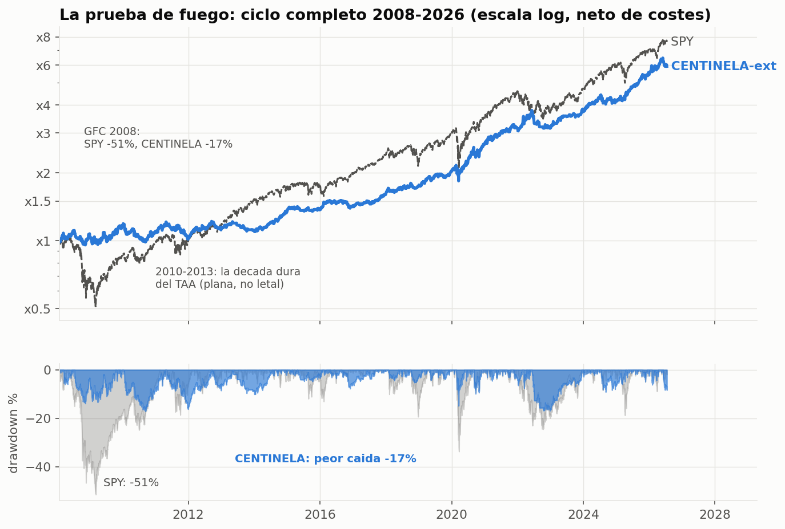
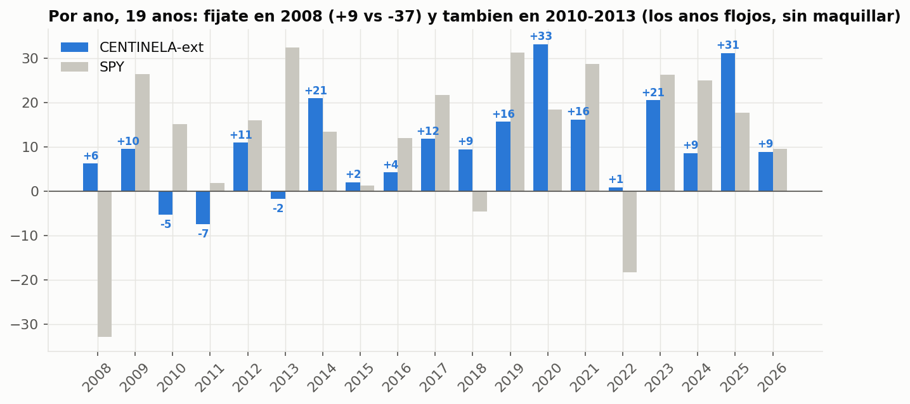

# La prueba de fuego: ciclo completo 2008–2026 y las campañas de reconfirmación

Esta página documenta el test más duro al que se ha sometido CENTINELA: extenderla a
**19 años de historia** (incluida la crisis de 2008) y lanzarle **685 configuraciones
retadoras** en dos campañas pre-registradas de búsqueda masiva. Es la página más
importante del repo para calibrar expectativas antes de invertir dinero real.

## 1. Los números a ciclo completo (2008–2026, neto de costes)

Reconstrucción canónica de CENTINELA sobre un dataset congelado de 25 ETFs (SHA256
registrado), con las mismas reglas exactas (semanal + banda 8%, 10 pb):

| Ventana | CAGR | Sharpe | Calmar | MaxDD |
|---|---:|---:|---:|---:|
| 2008–2017 (la década dura) | 4.9% | 0.52 | 0.28 | −17.1% |
| 2018–2022 | 14.6% | 1.15 | 0.87 | −16.9% |
| 2023–2026 | 19.5% | 1.71 | 2.13 | −9.1% |
| **Ciclo completo 2008–2026** | **10.1%** | **0.94** | **0.59** | **−17.1%** |
| SPY buy & hold (misma ventana) | 11.6% | 0.66 | — | **−51.5%** |
| QQQ buy & hold (misma ventana) | 17.0% | 0.81 | — | −49.4% |

## 2. Inflación de régimen: el matiz que casi nadie te cuenta

Los números "de folleto" de CENTINELA (CAGR 13%, Sharpe 1.41, MaxDD −9%) provienen de
2015–2026 — un periodo estructuralmente amable para la asignación táctica. Al incluir
2008–2014, la expectativa honesta cambia:

> **Contrato de ciclo completo: CAGR ~10%/año · Sharpe ~0.9 · caídas de hasta −17% ·
> posibilidad de 3–4 años seguidos mediocres (2010: −5.3%, 2011: −7.5%, 2013: −1.8%).**

Esto NO invalida la estrategia — al contrario, la pone en su sitio real:

- En la GFC 2008: **+9.2%** mientras el SPY hacía −37% (año) y −51% (peak-to-trough).
- Peor caída en 19 años: −17% vs −51% del SPY. Un tercio del dolor.
- Sharpe de ciclo completo 0.94 vs 0.66 del SPY: la ventaja de calidad se mantiene
  en el peor de los mundos, no solo en el amable.
- La década floja 2010–2013 fue **plana, no letal** — y es una propiedad de TODO el
  enfoque TAA en ese régimen, no un defecto de esta estrategia (ver §3).

## 3. Las campañas de reconfirmación: 685 retadoras, cero ganadoras

Para comprobar si existía algo mejor, se ejecutaron dos campañas de búsqueda masiva
**pre-registradas** (umbrales y grids firmados ANTES de mirar un solo resultado,
ledger central de todos los intentos, ventanas de validación selladas físicamente):

**Campaña I — 550 configuraciones, 7 familias** (variantes Keller HAA/DAA/BAA, Dual
Momentum de Antonacci, inverse-vol/risk-parity, selección defensiva por correlación,
mejoras del sleeve ofensivo…) sobre 2008–2017 como campo de desarrollo:

- Mejor retadora: Sharpe 0.854 en desarrollo… pero el **mejor de 550 ruidos
  aleatorios habría lucido 0.927**. Deflated Sharpe Ratio = 0.41 (umbral 0.95):
  **estadísticamente indistinguible del azar**. Además, frágil: perturbada ±1 paso
  de parámetro caía a Sharpe 0.61 con −30% de caída.
- Veredicto: 0 supervivientes de los gates pre-registrados.

**Campaña II — 135 ensembles canónicos** (sleeves elegidos por literatura publicada,
no por ranking: inverse-vol de libro, GEM Antonacci, HAA Keller + overlay de
vol-targeting 6–12% leakage-free):

- Hallazgo: añadir inverse-vol + control de volatilidad SÍ mejora Sharpe y caída en
  la década dura (hasta 0.96 / −9%)… pero **pagando crecimiento** (CAGR 4.8–5.5%,
  por debajo del suelo pre-registrado del 6%). Los gates no se relajan a posteriori.
- Veredicto: 0 finalistas; campaña cerrada.

**Resultado neto: CENTINELA reconfirmada dos veces**, y las ventanas de validación
2018–2022 y 2023–2026 quedaron sin abrir (vírgenes) para futuras campañas — la
disciplina anti-overfit al completo.

## 4. Qué significa esto para ti (checklist antes de invertir)

1. Firma el **contrato de ciclo completo** (§2), no el del folleto. Si un −17% o
   tres años planos te harían abandonar, esta estrategia (y probablemente ninguna
   de esta familia) no es para ti.
2. La razón para usar CENTINELA no es "gana más": es **ganar parecido a la bolsa con
   un tercio del desplome**, verificado en la peor crisis de los últimos 90 años.
3. Sobrevivió a 685 intentos serios de mejorarla bajo reglas que impiden hacerse
   trampas. Eso es lo máximo que un backtest puede ofrecer.
4. Empieza con una parte del capital y valida en real.

## 5. Trazabilidad

Las campañas viven en el repositorio de investigación privado del autor
(`ANALISIS_TECNICO/DEFINITIVA/`: informe completo, ledger de 685 trials, datos
congelados con SHA256, scripts de motor/familias/adversarial). Los números de esta
página provienen de `BASELINE_CENTINELA_EXT.json` y del dataset congelado
`etf_definitiva.csv` (25 ETFs, 2006–2026, yfinance total-return).

*Nota metodológica: la extensión 2008–2026 usa la reconstrucción canónica de la
estrategia (correlación diaria 0.85 con la versión exacta; misma señal de régimen el
99.2% de los días). Los pesos exactos de TradingView solo existen desde 2015.*
