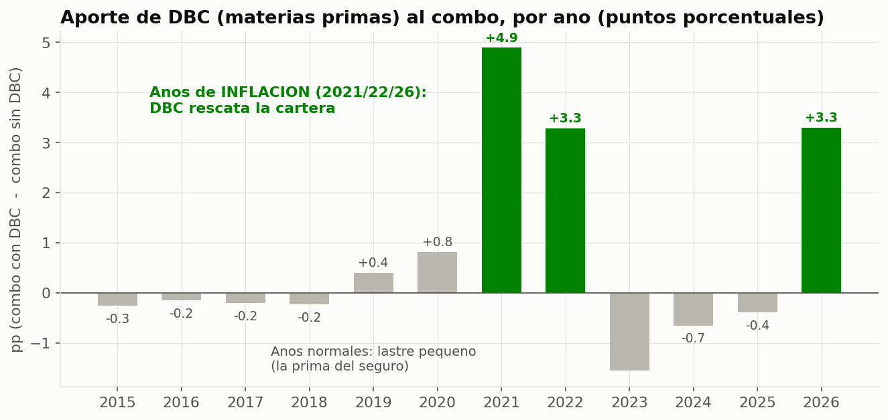
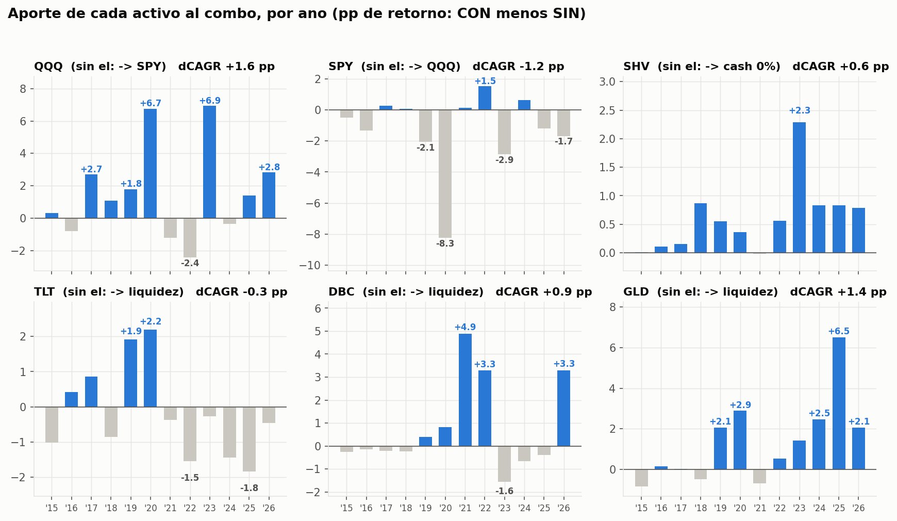

# ¿Por qué estos 6 activos? — el aporte de cada pieza

Este estudio empezó con una pregunta razonable sobre DBC (*"ha rendido regular toda
su vida, ¿por qué lo tenemos?"*) y acabó convertido en un **análisis leave-one-out
de los 6 activos** del combo, más el canario TIP. La primera mitad cuenta el caso
DBC (el ejemplo perfecto de la filosofía de la estrategia); la segunda aplica
exactamente el mismo estudio a todas las piezas.

## 1. Es verdad: DBC solo es mediocre

Comprar y mantener DBC (índice diversificado de materias primas) 2015–2026:

| Métrica | DBC buy & hold |
|---|---|
| Multiplicador | x1.89 |
| CAGR | **5.8%** |
| Sharpe | **0.41** |
| Peor caída (MaxDD) | **−41.7%** |

Como inversión pasiva, es floja: gana poco y cae mucho. La intuición de "esto no
aporta" es correcta… **para comprar-y-mantener**.

## 2. Pero el combo no lo compra-y-mantiene: lo *cronometra*

CENTINELA solo carga DBC cuando su momentum es positivo. Y ese filtro funciona:

> **DBC durante los días en que el combo lo tiene en cartera: +7.4%/año**
> DBC en general (siempre): +5.8%/año

El momentum le pilla las buenas rachas (inflación, tensión de oferta) y esquiva
los tramos muertos. Convierte un activo del montón en uno que suma.

Cuánto pesa en la práctica (peso *realmente mantenido* cada día, no el objetivo):
medio **7.8%**, máximo 26.9%; está en cartera el 76% de los días con un peso medio
del 10.2% cuando está. No es una posición grande — es un seguro modesto que se
agranda cuando toca.

## 3. Efecto neto en el combo: POSITIVO

Combo con DBC vs combo sin DBC (su peso reasignado a liquidez), regla semanal +
banda 8%, neto 10 pb:

| | CON DBC | SIN DBC |
|---|---:|---:|
| CAGR | **13.0%** | 12.2% |
| Sharpe | **1.41** | 1.39 |
| MaxDD | −9.1% | −8.9% |
| **Peor año** | **−2.1%** | **−5.0%** |

Quitarlo cuesta **−0.9 pp de CAGR** y, sobre todo, **empeora el peor año en 2.9 pp**.

## 4. El desglose que lo explica todo

| Año | Aporte de DBC al combo |
|---|---:|
| 2015 | −0.3 |
| 2016 | −0.2 |
| 2017 | −0.2 |
| 2018 | −0.2 |
| 2019 | +0.4 |
| 2020 | +0.8 |
| **2021** | **+4.9** ← inflación |
| **2022** | **+3.3** ← el año que el S&P hizo −18% |
| 2023 | −1.6 |
| 2024 | −0.7 |
| 2025 | −0.4 |
| **2026** | **+3.3** ← inflación |

En los años tranquilos DBC es un **lastre pequeño** (−0.2 a −1.6 pp): eso es lo que
se ve a simple vista. Pero en **2021, 2022 y 2026** aportó +4.9, +3.3 y +3.3. La
suma de sus tres rescates (~+11.5 pp) **triplica** la suma de todos sus lastres.

## 5. Su verdadero trabajo: estar en verde cuando todo cae

DBC no está para ganar la carrera larga. Está para ser lo que sube **cuando la
bolsa y los bonos caen a la vez**. En 2022 las acciones se hundieron (−18%), los
bonos largos (TLT) se hundieron *con* ellas (rompiendo su papel habitual de
refugio)… y las materias primas volaron. DBC fue, ese año, prácticamente **la
única pata en verde**. Convirtió lo que habría sido un −5.0% en un −1.8%.

Esa es la **diversificación de régimen**: metes un activo mediocre-de-media pero
**descorrelacionado en las crisis**, y dejas que el momentum lo cargue solo cuando
hace falta. El precio de ese seguro es un puntito en los años buenos. Barato.

---

## 6. El mismo estudio, para los seis (y el canario)

Metodología idéntica al caso DBC, sobre los **pesos exactos** de la estrategia
(semanal + banda 8%, neto 10 pb, leakage-free, 2015-03 → 2026-07, N=2.843 días).
Para cada activo se simula el combo **SIN él**, reasignando su peso al sustituto
natural:

| Activo | Sustituto en el contrafactual "SIN" | Qué mide |
|---|---|---|
| TLT, DBC, GLD | → liquidez (SHV) | ¿Paga su sitio el defensivo? |
| QQQ | → SPY | ¿Aporta el Nasdaq sobre el S&P? |
| SPY | → QQQ | ¿Aporta el S&P sobre el Nasdaq? |
| SHV | → cash al 0% (mismo peso, sin remunerar) | ¿Cuánto vale remunerar la liquidez? |
| TIP (canario) | régimen sin canario (solo mom SPY / mom QQQ) | ¿Cuánto vale la señal? |

Dos avisos de honestidad: (a) la reasignación es mecánica — no re-ejecuta la
selección por momentum sin ese activo — así que es un contrafactual conservador;
para los defensivos se probó también la convención alternativa (reasignar
proporcionalmente al resto del menú defensivo) y **ninguna conclusión cambia de
signo**. (b) "Aporte por año" = retorno anual CON menos retorno anual SIN.

## 7. Tabla resumen: qué pasa si quitas cada pieza

Δ = CON − SIN (positivo = el activo suma al combo):

| Activo | Papel | B&H CAGR / Sharpe | Cronometrado | Peso medio | ΔCAGR | ΔSharpe | Δ peor año |
|---|---|---|---:|---:|---:|---:|---:|
| QQQ | Motor de crecimiento | 19.2% / 0.91 | **25.0%** | 27% | **+1.6 pp** | −0.02 | +0.3 pp |
| SPY | Motor estable | 13.8% / 0.82 | **21.4%** | 20% | −1.2 pp | **+0.05** | **+1.2 pp** |
| SHV | Ancla remunerada | 2.0% / — | 2.0% | 29% | +0.6 pp | +0.07 | +0.2 pp |
| TLT | Seguro de deflación | −1.2% / −0.01 | −1.4% | 7% | **−0.3 pp** | **−0.02** | **−1.0 pp** |
| DBC | Seguro de inflación | 5.8% / 0.41 | 7.4% | 8% | +0.9 pp | +0.02 | **+2.9 pp** |
| GLD | Diversificador | 11.4% / 0.75 | 13.3% | 9% | **+1.4 pp** | **+0.08** | +0.2 pp |
| TIP* | Canario (solo señal) | — | — | 0% | +0.7 pp | **+0.13** | **+4.8 pp** |

*"Cronometrado" = CAGR del activo solo en los días en que el combo lo tiene (peso >1%).
TIP\* medido sobre la reconstrucción canónica (la señal no se puede re-ejecutar sobre
los pesos propietarios); lo comparable es el delta interno CON vs SIN.*

## 8. Veredicto pieza a pieza

**QQQ — el motor que paga las facturas.** Cronometrado rinde un 25%/año (vs 19%
siempre): el filtro canario le quita justo los tramos malos. Sustituirlo por SPY
cuesta **−1.6 pp de CAGR** con Sharpe y MaxDD casi idénticos: es retorno casi
gratis. Sus rescates: +6.7 pp en 2020 y +6.9 pp en 2023. Curiosidad: el combo sin
QQQ *ni* SPY (todo a liquidez) tendría Sharpe 1.54… con CAGR 7.4% — calidad sin
crecimiento, el mismo perfil que las campañas de reconfirmación descartaron por
no llegar al suelo de crecimiento (ver [CICLO_COMPLETO.md](CICLO_COMPLETO.md) §3).

**SPY — el estabilizador del motor.** La pregunta simétrica: ¿por qué no todo QQQ?
Porque todo-QQQ gana +1.2 pp más de CAGR pero **empeora el Sharpe (1.36 vs 1.41),
profundiza el MaxDD a −11.6% y el peor año a −3.3%**. SPY diversifica el riesgo de
motor (2022: aportó +1.5 pp justo cuando el Nasdaq sangraba). En un perfil
conservador, ese intercambio — ceder 1.2 pp por dormir mejor — es exactamente el
contrato de la estrategia. Y cronometrado (solo en RISK-ON) rinde 21.4%/año vs
13.8% siempre: el régimen funciona.

**SHV — el carry gratis.** Comparado con dejar la liquidez sin remunerar, SHV
añade **+0.6 pp de CAGR y +0.07 de Sharpe** sin coste alguno. Su aporte crece con
los tipos: +2.3 pp en 2023. Con un peso medio del 29% (es el ancla del RISK-OFF y
del menú defensivo), remunerarlo no es un detalle — es la diferencia entre
"esperar" y "cobrar por esperar".

**TLT — el marginal, confirmado y cuantificado.** El único activo cuya retirada
**mejora todo in-sample**: +0.3 pp de CAGR, +0.02 de Sharpe y peor año −1.1% vs
−2.1% (robusto a las dos convenciones de reasignación). Ni el timing lo rescata
(−1.4%/año incluso cronometrado): el momentum no puede salvar a un activo en
mercado bajista estructural (subida de tipos 2021–2026, aporte negativo seis años
seguidos). ¿Por qué sigue? Por el argumento simétrico al de DBC: TLT es el seguro
del **crash deflacionario** (aportó +1.9 en 2019 y +2.2 en 2020), y la ventana
2015–2026 contiene **dos episodios inflacionarios y solo uno deflacionario** — la
muestra está sesgada contra TLT igual que estaba sesgada a favor de DBC. Echarlo
por perder en *esta* muestra sería exactamente el error de ajustarse al régimen
que este documento desaconseja. En el ciclo completo 2008–2026 (ver
[CICLO_COMPLETO.md](CICLO_COMPLETO.md)), la década 2008–2017 fue el escenario
donde los bonos largos se ganaron el sueldo.

**GLD — el defensivo MVP (el hallazgo del estudio).** El título de "diversificador
clave" se queda corto: GLD tiene el **mayor ΔSharpe de todos los activos (+0.08)**
y +1.4 pp de CAGR, con solo un 9% de peso medio. Está en cartera el 90% de los
días, cronometrado rinde 13.3%/año, y sus aportes son grandes *y frecuentes*:
+2.1 (2019), +2.9 (2020), +1.4 (2023), +2.5 (2024), **+6.5 (2025)**, +2.1 (2026).
Sus peores años le cuestan al combo menos de 1 pp. Es la pieza defensiva más
valiosa del combo: aporta en crisis deflacionarias (2020), inflacionarias (2022+)
y en rallies del oro (2024–25). Quitarlo también empeora el MaxDD (−9.8% vs −9.1%).

## 9. El canario TIP: la señal que no se ve en la cartera

TIP nunca pesa un dólar en la cartera, pero su momentum decide el RISK-ON/OFF
(junto a SPY) y activa el motor QQQ. Ablación de la señal sobre la reconstrucción
canónica (mismo universo, mismas reglas, canario apagado):

| | CON canario TIP | SIN canario |
|---|---:|---:|
| CAGR | 14.8% | 14.2% |
| Sharpe | **1.31** | 1.17 |
| MaxDD | **−16.9%** | −18.5% |
| **Peor año** | **−4.2%** | **−9.0%** |

El canario es el **interruptor de protección**: +9.9 pp en 2022 y +7.1 pp en 2018
(los dos bears de tipos), a cambio de whipsaws en años alcistas (−7.3 en 2017,
−4.0 en 2024). Neto: +0.13 de Sharpe y peor año a la mitad. La inflación esperada
(que es lo que TIP añade sobre un bono nominal) resulta ser un termómetro de
régimen que el precio del propio SPY no da.

## 10. Conclusión: se quedan los seis (y ahora sabemos por qué cada uno)

| Activo | ¿Se paga su sitio? | Su trabajo |
|---|---|---|
| QQQ | **Sí** (+1.6 pp CAGR) | Crecer en RISK-ON |
| SPY | **Sí** (+0.05 Sharpe, mejor peor año) | Estabilizar el motor |
| SHV | **Sí** (+0.6 pp gratis) | Cobrar por esperar |
| **GLD** | **Sí — el MVP defensivo** (+1.4 pp, +0.08 Sharpe) | Diversificar en todo régimen |
| **DBC** | **Sí — seguro de inflación** (peor año −2.1 vs −5.0) | El único verde en 2022 |
| TLT | **Marginal** (−0.3 pp in-sample) | Seguro de deflación — pagó en 2019–20, sesgo de muestra en contra |
| TIP | **Sí — como señal** (+0.13 Sharpe) | Detectar el cambio de régimen |

**Conclusión operativa:** se mantienen los 6 + canario. Si algún día se recorta
por simplicidad, el candidato sigue siendo TLT — nunca DBC ni GLD — y aun así el
estudio recomienda no hacerlo: su prima de seguro (−0.3 pp/año) es barata para el
único régimen (deflación con crash) contra el que nada más del menú protege tan
directamente.

---

*Reproducible con `scripts/estudio_aporte_activos.py` (motor: `scripts/apr_combo.py`
+ `scripts/backtest_taa.py`) sobre `data/etf_adjclose.csv`. Resultados numéricos en
`data/asset_study_summary.csv`. Ver también [ROBUSTEZ.md](ROBUSTEZ.md) §6 y el
contexto de ciclo completo en [CICLO_COMPLETO.md](CICLO_COMPLETO.md).*
